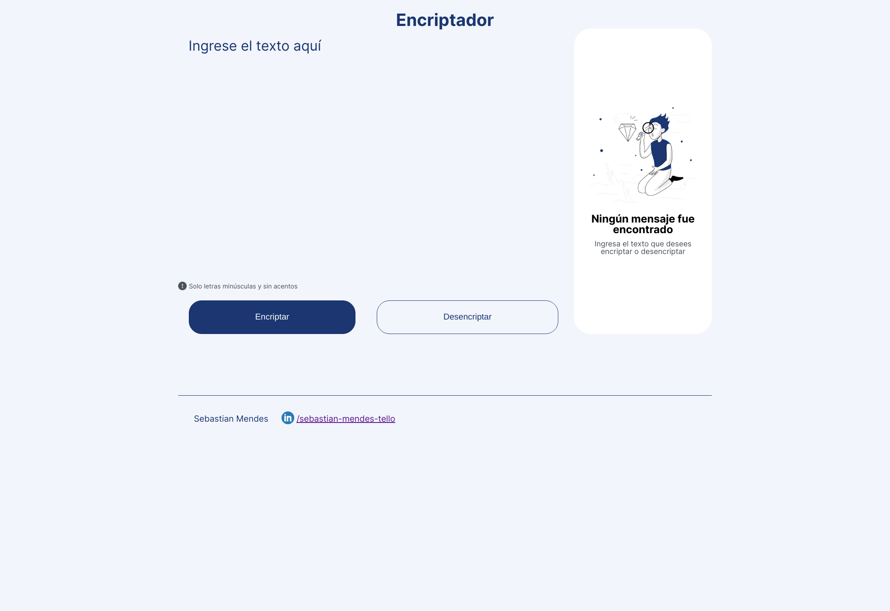

# Encriptador

Esta aplicación encripta textos, así podrás intercambiar mensajes secretos con otras personas que sepan el secreto o clave de la encriptación utilizada.

La interfaz es muy intuitiva por lo que no requiere mucha explicación. Se debe ingresar el texto donde se indica y presionar el botón "Encriptar" o "Desencriptar" según la acción que se quiera realizar. El resultado se mostrará en el cuadro de resultados que le sigue.

La aplicación posee un diseño responsivo que varía entre Mobile, Tablet y Desktop.

## Autor

**Sebastián Mendes Tello**
          

          

## Tecnologías utilizadas

     

## Repositorio

## Screenshots

